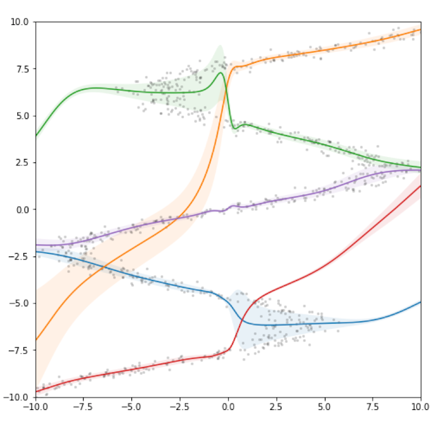

## Tutorial: Mixture Density Networks with JAX ##

*April 2020*

Tutorial Notebook: [mixture_density_networks_jax.ipynb](mixture_density_networks_jax.ipynb)

Reference paper: [Mixture Density Networks](https://publications.aston.ac.uk/id/eprint/373/1/NCRG_94_004.pdf) (Bishop, 1994)

Related posts:
- JavaScript [Tutorial](http://blog.otoro.net/2015/06/14/mixture-density-networks/)
- TensorFlow [Tutorial](http://blog.otoro.net/2015/11/24/mixture-density-networks-with-tensorflow/)
- PyTorch [Tuturial](https://github.com/hardmaru/pytorch_notebooks/blob/master/mixture_density_networks.ipynb)

This tutorial is based on the recent PyTorch notebook with many improvements added by [kylemcdonald](https://github.com/kylemcdonald).

*Note: This notebook describes a slightly different loss formulation compared to the previous tutorials that is much more numerically stable, and is used in most of my other recent [projects](https://otoro.net/ml/) that needed MDNs.*

JAX is a minimal framework to automatically calculate the gradients of native Python and NumPy / SciPy functions. It is a nice tool in the machine learning research toolbox.

Recommended [JAX](https://github.com/google/jax/) Tutorials: [Getting started with JAX](https://roberttlange.github.io/posts/2020/03/blog-post-10/) and [You don't know JAX](https://colinraffel.com/blog/you-don-t-know-jax.html).

## License

MIT
